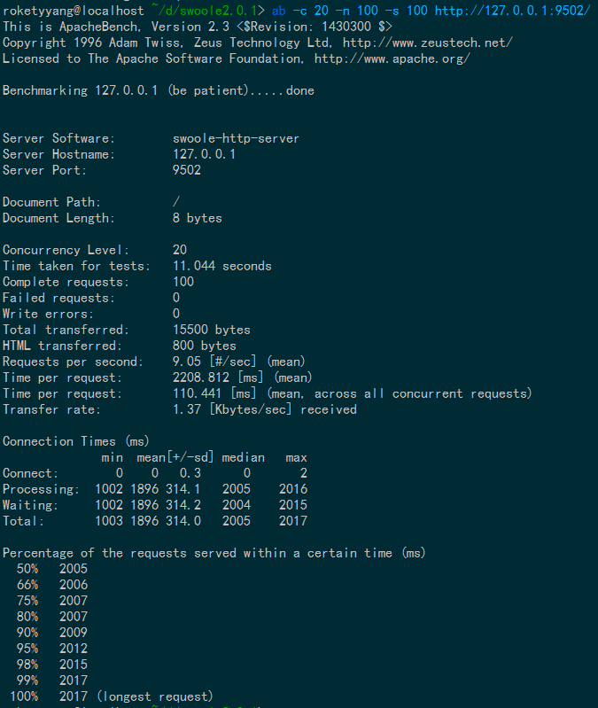
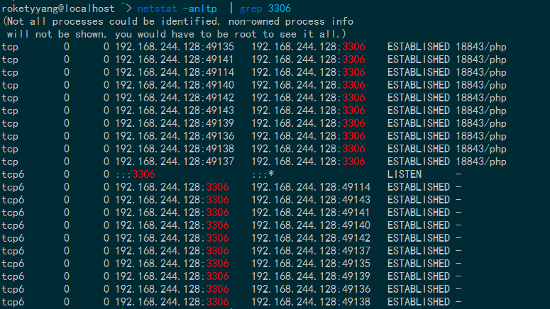
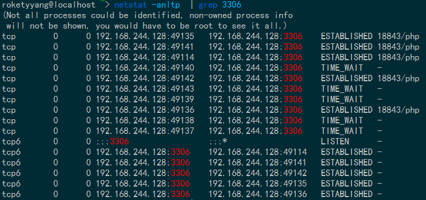

基于Swoole2协程特性实现的MySQL连接池
- - -
使用Swoole2的\Swoole\Coroutine\MySQL创建连接，通过静态类和静态成员属性维护连接池，不同协程可以共享该连接池。

排队机制（先进先出）使用协程的特殊功能实现：

* `\Swoole\Coroutine::resume($name)`：从$name队列中恢复一个挂起的协程执行；
* `\Swoole\Coroutine::suspend($name)`：将当前协程挂起到$name队列上。

### 限制

* 每个worker都有各自的MySQL连接池，且不同worker之间无法共享彼此的MySQL连接池；
* 可能存在各个worker进程连接池利用率不同（依赖业务实现）。

### 优点

* 与独立的连接池（worker进程间可共享的连接池实现）对比，无进程间通信开销；
* 独立的连接池需要增加运维成本。

### 使用方法

```php
/**
 * 初始化连接池
 *
 * @param array $connsConfig 配置数组
 *	 [
 *		 'connName1' => [
 *			'serverInfo' => ['host' => '127.0.0.1', 'user' => 'test', 'password' => 'pass', 'database' => 'tt', 'charset' => 'utf8'], //\Swoole\Coroutine\MySQL的connect参数
 *			'maxSpareConns' => 5, //最大空闲连接数
 *			'maxConns' => 10, //最大连接数
 *		 ],
 *		 'connName2' => [
 *			'serverInfo' => ['host' => '127.0.0.2', 'user' => 'test', 'password' => 'pass', 'database' => 'tt', 'charset' => 'utf8'], //\Swoole\Coroutine\MySQL的connect参数
 *			'maxSpareConns' => 5, //最大空闲连接数
 *			'maxConns' => 10, //最大连接数
 *		 ],
 *	 ]
 */
Swoole\Coroutine\Pool\MySQLPool::init(array $connsConfig)

/**
 * 回收连接，该连接必须是从连接池中获取的连接
 *
 * @param \Swoole\Coroutine\MySQL $conn 从连接池中获取的连接
 */
Swoole\Coroutine\Pool\MySQLPool::recycle(\Swoole\Coroutine\MySQL $conn)

/**
 * 从连接池中获取一条连接
 *
 * @param string $connName init时配置的连接，根据连接名称获取对应的连接
 * @return \Swoole\Coroutine\MySQL 返回一个连接实例
 */
Swoole\Coroutine\Pool\MySQLPool::fetch($connName)
```

### 使用示例

```php
<?php
require 'MySQLPool.php';
use Swoole\Coroutine\Pool\MySQLPool;

$server = new Swoole\Http\Server("127.0.0.1", 9502, SWOOLE_BASE);
$server->set([
        'worker_num' => 1,
]);
$server->on('Request', function($request, $response) {
        MySQLPool::init([
                'test' => [
                        'serverInfo' => ['host' => '192.168.244.128', 'user' => 'mha_manager', 'password' => 'mhapass', 'database' => 'tt', 'charset' => 'utf8'],
                        'maxSpareConns' => 5,
                        'maxConns' => 10
                ],
        ]);
        $swoole_mysql = MySQLPool::fetch('test');
        $ret = $swoole_mysql->query('select sleep(1)');
        MySQLPool::recycle($swoole_mysql);
        $response->end('Test End');
});
$server->start();
```

压测命令：`ab -c 20 -n 100 -s 100 http://127.0.0.1:9502/`，20并发，共100个请求。

压测结果：



压测时连接情况：



压测后连接情况：



这里服务端只有1个worker进程在工作，完成100个请求，且每个请求的SQL查询是sleep 1秒，花了约11秒，如果是php-fpm+mysqli这样的模式，1个worker进程，那么得花100秒。

所以这正是协程的优势所在，利用非阻塞IO+协程切换，1个worker进程能同时处理多个客户端请求，大大提高了并发量。
